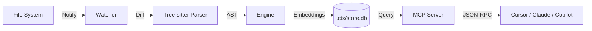

<div align="center">

# .CTX

**The Context Protocol**
<br>
_The Open Standard for AI Context Memory_

[](https://www.rust-lang.org/)
[](https://opensource.org/licenses/MIT)
[](http://makeapullrequest.com)

</div>

---

## 📐 The Missing Pillar

In modern software engineering, we have solved Version Control and Environment Consistency. usage context is the final frontier.

| System | **Git** | **Docker** | **.CTX** |
| :--- | :--- | :--- | :--- |
| **Domain** | Source Code (Time) | Environment (Space) | **Context (Meaning)** |
| **Unit** | Commits / Diffs | Containers / Images | **Semantic Tokens** |
| **Problem** | "Who changed what?" | "It works on my machine" | **"What does this code do?"** |
| **Result** | History Safety | Reproducibility | **Self-Explaining Codebase** |

**.CTX** (pronounced "dot-context") is a local daemon that turns any project into a self-explaining entity. It ensures that every AI tool—whether it's GitHub Copilot, Cursor, or a local LLM—shares a single, unified understanding of your codebase.

## 🚀 Why .CTX?

**The Problem: Siloed Intelligence**
Every new AI tool you use re-indexes your code from scratch. They are strangers to your project, guessing context based on open files or naive text chunking. They don't talk to each other, and they forget everything when you close the session.

**The Solution: A Shared Protocol**
`.CTX` runs locally, watching your file system. It proactively parses code, understands dependencies, and maintains a high-fidelity context map in a standardized `.ctx/` directory.
- **Write Once:** Your context is calculated once.
- **Read Everywhere:** Exposed via **MCP (Model Context Protocol)** to any supported editor or agent.

## 🏗️ Architecture

The system is designed as a modular, high-performance daemon built in Rust.



### Folder Structure
The `.ctx` folder acts as the brain of your repository:
- `config.toml`: Protocol settings (ignore patterns, language policies).
- `store.db`: SQLite database storing semantic relationships and symbols.
- `vector/`: Local vector store for semantic search.

## ⚡ Getting Started

### Installation
(Assuming crate publication)
```bash
cargo install ctx
```

### Initialization
Turn your current directory into a Context-Aware project:
```bash
ctx init
```
This creates the `.ctx` skeleton and begins the initial indexing process.

### Usage
Start the background daemon to keep context in sync:
```bash
ctx daemon start
```

Check the status of the context index:
```bash
ctx status
```

## 🔌 Integration

### Cursor / VS Code
`.CTX` generates a dynamic `.cursorrules` file or exposes a local server that Cursor allows you to hook into, providing "God-mode" context awarness without uploading your code to the cloud.

### Claude Desktop
Configure your `claude_desktop_config.json` to use the locally running .CTX MCP server:

```json
{
  "mcpServers": {
    "ctx": {
      "command": "ctx",
      "args": ["mcp", "start"]
    }
  }
}
```

## 🗺️ Roadmap

- [x] **Phase 1: Local Context Map** (Complete)
    - File watching, Tree-sitter parsing, and SQLite storage.
- [ ] **Phase 2: Semantic Vector Sync** (In Progress)
    - Local embedding generation and RAG interface.
- [ ] **Phase 3: Global Standard**
    - Native integration plugins for JetBrains and VS Code.

## 📄 License

This project is licensed under the [MIT License](LICENSE).
