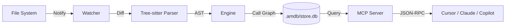

<div align="center">

# .amdb

**The Open Standard for AI Context Memory**

[](https://www.rust-lang.org/)
[](https://opensource.org/licenses/MIT)

</div>

---

## 📐 The Missing Pillar

**Is your AI guessing?**

Most AI tools (RAG, Vector Embeddings) rely on "fuzzy" matching—finding text that looks similar. This is great for natural language, but **terrible for code**. Code is precise; dependencies are DAGs, not probability distributions.

**.amdb** (Agent Memory Database) introduces a **Deterministic Context Layer**:
- **Traditional RAG:** "Find code that looks like 'authentication'" → Returns random specialized auth logic mixed with comments.
- **.amdb Protocol:** "Find the function calling `User::login` and all its implementations" → Returns the exact Call Graph and Symbol references.

We bridge the gap between **Fuzzy Search** and **Code Structure**, giving your AI the "God-mode" accuracy it lacks.

---

## 🏗️ Architecture

`.amdb` runs as a high-performance local daemon, turning your codebase into a queryable knowledge graph.



1.  **File Detection:** `notify` watches for real-time changes.
2.  **Parsing:** `tree-sitter` extracts symbols, ASTs, and imports (Rust, Python, JS/TS supported).
3.  **DB Storage:** Relationships are stored in a local SQLite graph (`.amdb/store.db`).
4.  **MCP Server:** Exposes data via the **Model Context Protocol** to any agent.

---

## ⚡ Usage Workflow

### 1. Initialization
Turn any folder into a context-aware project:
```bash
amdb init
```

### 2. Start the Daemon
Launch the background server to keep context in sync and serve the MCP API:
```bash
amdb daemon start
```
> **Note:** The server binds to `0.0.0.0:3000` by default.

### 3. Check Status
Verify that your codebase is indexed and the protocol is active:
```bash
amdb status
```

---

## 💬 How to use with AI (Crucial)

Since standard AI models rely on embeddings, **you must explicitly instruct them** to use `.amdb` for structural accuracy.

### 📋 Session Start Prompt
Copy and paste this prompt at the beginning of your Cursor/Claude session:

> "I am using `.amdb` in this project. It maintains a deterministic database of symbols and call graphs at `.amdb/store.db`.
>
> **Rule 1:** When I ask about code structure (e.g., 'Who calls this?', 'Where is X defined?'), you MUST prioritize the `.amdb` data over your internal embedding search.
> **Rule 2:** If connected via MCP, use the `get_context` tool first.
> **Rule 3:** Trust the `.amdb` relationships table as the source of truth for dependencies."

## 🔌 Integration

### Cursor
Cursor can natively talk to local servers. Add `.amdb` as a context source (feature coming soon) or use our generated `.cursorrules` to guide the model.

### Claude Desktop (MCP)
Add the following to your `claude_desktop_config.json` to enable .amdb as a tool:

```json
{
  "mcpServers": {
    "amdb": {
      "command": "amdb",
      "args": ["mcp", "start"]
    }
  }
}
```

Now you can ask Claude: *"What is the relationship between `User` and `Session` structs in this project?"*

---

## 🗺️ Roadmap

- [x] **Phase 1: Local Context Map** (Complete)
    - Real-time file watching, Tree-sitter parsing, SQLite Graph storage.
- [ ] **Phase 2: Semantic Vector Sync** (In Progress)
    - Hybrid search combining Deterministic Graph + Semantic Embeddings.

---

## 📄 License

This project is licensed under the [MIT License](LICENSE).
